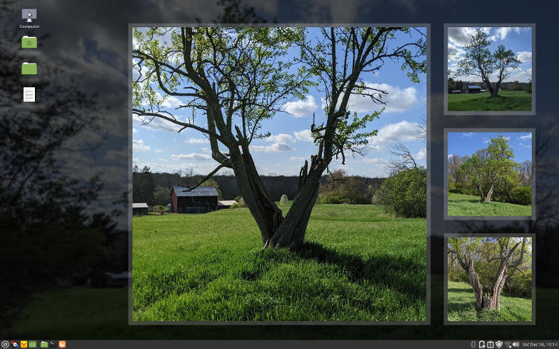
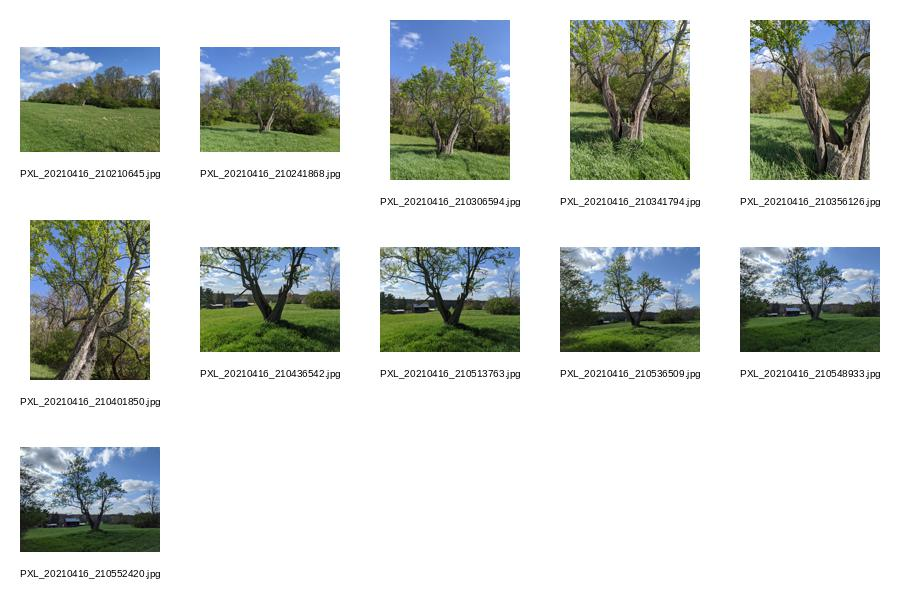

# montage #

**montage.py** creates a montage given a list of images and parameters for placing them.

This is a command-line tool, not a graphical tool. Selecting images for a montage is a manual process, done in a file manager. While the tool supports command-line arguments, using an *options (settings) file* is more convenient. Image file names can be copied (Ctrl+C in a file manager) and pasted (Ctrl+V in a text editor) into an options file.

## Getting Started

To create an options file to use as a starting point, run montage.py with only the `--write-opts` option:

    montage.py --write-opts

This will create a blank image file named **output.jpg** (which can be deleted) and a text file named **output_options.txt** that has the default options used to generate the blank image. This text file can serve as a template that can be renamed and edited to set desired options for making a montage image. The sections that begin with **"[LOG:"** should be deleted.


## Examples


A montage as **desktop wallpaper**.

[Options file](./examples/opt-tree-05-1680x1050-2.txt) used to generate the montage image.

---


An example of a **catalog image**.

[Options file](./examples/tree-catalog.opt) used to generate the catalog image.

---

## Options

**Options Table**

| LONG OPTION        | SHORT OPTION | OPTIONS FILE        | DESCRIPTION                                                                                                                                                                                                                                    |
| :----------------- | :----------- | :------------------ | :--------------------------------------------------------------------------------------------------------------------------------------------------------------------------------------------------------------------------------------------- |
| (images)           |              | [images]            | Image file names are the initial (positional) command-line arguments.                                                                                                                                                                          |
| --settings-file    | -s           |                     | Name of settings (options) file.                                                                                                                                                                                                               |
| --output-file      | -o           | output_file=        | Name of output file.                                                                                                                                                                                                                           |
| --output-dir       | -d           | output_dir=         | Name of output directory.                                                                                                                                                                                                                      |
| --canvas-width     | -x           | canvas_width=       | Canvas width in pixels.                                                                                                                                                                                                                        |
| --canvas-height    | -y           | canvas_height=      | Canvas height in pixels.                                                                                                                                                                                                                       |
| --columns          | -c           | columns=            | Number of columns.                                                                                                                                                                                                                             |
| --rows             | -r           | rows=               | Number of rows.                                                                                                                                                                                                                                |
| --margin           | -m           | margin=             | Margin in pixels.                                                                                                                                                                                                                              |
| --padding          | -p           | padding=            | Padding in pixels.                                                                                                                                                                                                                             |
| --zoom             | -z           | do_zoom=            | Zoom images to fill instead of fitting to frame.                                                                                                                                                                                               |
| --border-width     |              | border_width=       | Border width in pixels.                                                                                                                                                                                                                        |
| --border-rgba      |              | border_rgba=        | Border color as red,green,blue,alpha.                                                                                                                                                                                                          |
| --label-font       |              | label_font=         | Font to use for file name label added to images. A file name label is useful for making an image catalog.                                                                                                                                      |
| --label-size       |              | label_size=         | Point size for font used to add a file name label to images.                                                                                                                                                                                   |
| --background-rgba  | -b           | background_rgba=    | Background color as red,green,blue,alpha.                                                                                                                                                                                                      |
| --background-blur  |              | background_blur=    | Blur radius for background image (0 = none).                                                                                                                                                                                                   |
| --background-image | -g           | [background-images] | Name of image file to use as the background image.                                                                                                                                                                                             |
| --shuffle-mode     |              | shuffle_mode=       | Flags that control shuffling (random order):<br />i = images<br />b = background image<br />c = columns<br />r = rows<br />n = do not start over at beginning of list when all images have been used.<br />Example: --shuffle-mode=ib          |
| --shuffle-count    |              | shuffle_count=      | Number of output files to create when using --shuffle-mode.                                                                                                                                                                                    |
| --stamp-mode       |              | stamp_mode=         | Mode for adding a date_time stamp to the output file name:<br />0 = none<br />1 = at left of file name<br />2 = at right of file name<br />3 = at left of file name, include microseconds<br />4 = at right of file name, include microseconds |
| --quit             | -q           |                     | Quit immediately when there is an error. By default you are asked to press Enter to acknowledge the error message.                                                                                                                             |
| --write-opts       |              | write_opts=         | Write the option settings to a file.                                                                                                                                                                                                           |
| --feature-1        |              | [feature-1]         | Attributes for first featured image as (col, ncols, row, nrows, file_name).                                                                                                                                                                    |
| --feature-2        |              | [feature-2]         | Attributes for second featured image as (col, ncols, row, nrows, file_name).                                                                                                                                                                   |
| *(n/a)*            |              | [images-1]          | Begin list of image file names (one per line) from which one image is included in each succesive montage.                                                                                                                                      |
| *(n/a)*            |              | img1_pos=           | Fixed cell number for image from [images-1] list (starting at 1 for top-left and counting first across columns).                                                                                                                               |

---

### Shuffle

The idea behind *random shuffling* is that it may produce interesting layouts, combintations, and juxtapositions, that might not be discovered by simply selecting from a collection of images by hand. In addition to *images* and *background images*, the number of *columns* and *rows* can be shuffled based on the `columns` and `rows` options. By using the `--write-opts` flag, the options log that is produced along with the image can be used as the starting point for a new options file to recreate a desired (non-random) montage.

## Command Line Usage ##

```
usage: montage.py [-h] [-s SETTINGS_FILE] [-o OUTPUT_FILE] [-d OUTPUT_DIR]
                  [-x CANVAS_WIDTH] [-y CANVAS_HEIGHT] [-c COLS] [-r ROWS]
                  [-m MARGIN] [-p PADDING] [-b BG_RGBA_STR]
                  [--border-width BORDER_WIDTH]
                  [--border-rgba BORDER_RGBA_STR] [-g BG_FILE]
                  [--background-blur BG_BLUR] [--feature-1 FEATURE_1]
                  [--feature-2 FEATURE_2] [--shuffle-mode SHUFFLE_MODE]
                  [--shuffle-count SHUFFLE_COUNT] [--stamp-mode STAMP_MODE]
                  [-z] [-q] [--write-opts] [--label-font LABEL_FONT]
                  [--label-size LABEL_SIZE]
                  [images [images ...]]

Create an image montage given a list of image files.

positional arguments:
  images                Images files to include in the montage image. Multiple files can be specified.

optional arguments:
  -h, --help            show this help message and exit
  -s SETTINGS_FILE, --settings-file SETTINGS_FILE
                        Name of settings (options) file.
  -o OUTPUT_FILE, --output-file OUTPUT_FILE
                        Name of output file.
  -d OUTPUT_DIR, --output-dir OUTPUT_DIR
                        Name of output directory.
  -x CANVAS_WIDTH, --canvas-width CANVAS_WIDTH
                        Canvas width in pixels.
  -y CANVAS_HEIGHT, --canvas-height CANVAS_HEIGHT
                        Canvas height in pixels.
  -c COLS, --columns COLS
                        Number of columns.
  -r ROWS, --rows ROWS  Number of rows.
  -m MARGIN, --margin MARGIN
                        Margin in pixels.
  -p PADDING, --padding PADDING
                        Padding in pixels.
  -b BG_RGBA_STR, --background-rgba BG_RGBA_STR
                        Background color as red,green,blue,alpha.
  --border-width BORDER_WIDTH
                        Border width in pixels.
  --border-rgba BORDER_RGBA_STR
                        Border color as red,green,blue,alpha.
  -g BG_FILE, --background-image BG_FILE
                        Name of image file to use as the background image.
  --background-blur BG_BLUR
                        Blur radius for background image (0 = none).
  --feature-1 FEATURE_1
                        Attributes for first featured image as (col, ncols, row, nrows, file_name).
  --feature-2 FEATURE_2
                        Attributes for second featured image as (col, ncols, row, nrows, file_name).
  --shuffle-mode SHUFFLE_MODE
                        Flags that control shuffling (random order):
                            i = images
                            b = background image
                            c = columns
                            r = rows
                            n = do not start over at beginning of list
                                when all images have been used.
                        Example: --shuffle-mode=ib
  --shuffle-count SHUFFLE_COUNT
                        Number of output files to create when using --shuffle-mode.
  --stamp-mode STAMP_MODE
                        Mode for adding a date_time stamp to the output file name:
                            0 = none
                            1 = at left of file name
                            2 = at right of file name
                            3 = at left of file name, include microseconds
                            4 = at right of file name, include microseconds
  -z, --zoom            Zoom images to fill instead of fitting to frame.
  -q, --quit            Quit immediately when there is an error. By default you are asked to press Enter to acknowledge the error message.
  --write-opts          Write the option settings to a file.
  --label-font LABEL_FONT
                        Font to use for file name label added to images. A file name label is useful for making an image catalog.
  --label-size LABEL_SIZE
                        Point size for font used to add a file name label to images.
```

## Known Issues

- There is minimal error checking on values passed as arguments, or set in an options file, so runtime errors, rather than helpful messages, are likely.
- The default output image format is [JPEG](https://pillow.readthedocs.io/en/stable/handbook/image-file-formats.html#jpeg) (.jpg) at the default quality setting in Pillow. If the **output_file** name is given a different extension (**.png** for example), Pillow may be able to save in that format.
- When using the **label_font** option, there is no provision for a default font. The user must find and enter the name of a *TrueType* font installed on the system.
- The application was developed on Linux (Ubuntu 20.04.3 LTS) and has not been tested by the author on any other operating system.

## Reference

Python Pillow [home page](https://python-pillow.org/)

Pillow (PIL Fork) [documentation](https://pillow.readthedocs.io/en/stable/)

Docs - Reference - [Image Module](https://pillow.readthedocs.io/en/stable/reference/Image.html)

Python - [random](https://docs.python.org/3/library/random.html#random.shuffle)
